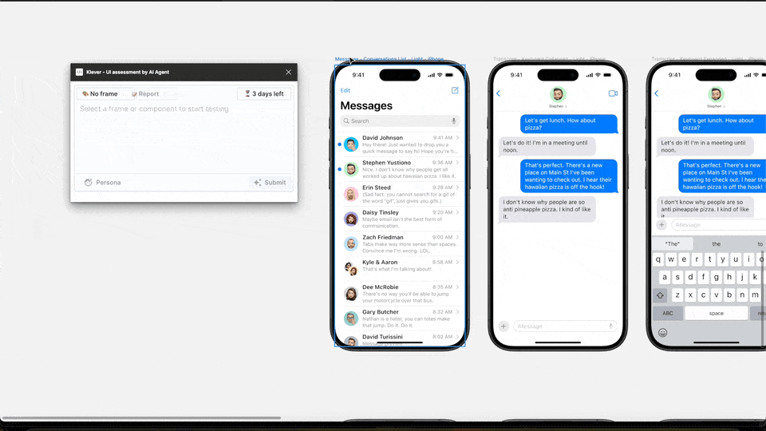

# Klever Issue Tracker

  

Welcome to the Klever Issue Tracker! This repository is dedicated to collecting feedback, bug reports, and feature requests from users of the Klever Figma plugin. Your input is invaluable in helping us improve Klever and make it an even more powerful tool for UI analysis powered by AI.

## How to Report an Issue or Request a Feature

To ensure that your feedback is addressed efficiently, we kindly ask you to follow these steps:

### Reporting Bugs

1. **Check Existing Issues**: Before submitting a new bug report, please check if it has already been reported by another user. If you find an existing report, feel free to add any additional information you may have in the comments.
2. **Create a New Issue**: If your bug hasn't been reported yet, please [create a new issue](https://github.com/FigmaAI/klever-support/issues/new) using the "Bug Report" template. Provide as much detail as possible, including steps to reproduce the bug, expected behavior, and actual behavior.

### Requesting Features

1. **Check Existing Requests**: Take a moment to browse through the existing issues to see if someone else has already requested the same feature. If so, you can add your support by commenting on the issue.
2. **Create a New Issue**: If your feature request is new, please [create a new issue](https://github.com/FigmaAI/klever-support/issues/new) using the "Feature Request" template. Describe the feature you'd like to see, its potential benefits, and any ideas you have about how it might work.

## Contributing

While this repository is primarily for tracking issues and feature requests, we welcome contributions to the Klever project itself. If you're interested in contributing to the development of Klever, please visit our main repository:

- [AppAgent Main Repository](https://github.com/dusskapark/AppAgent)

## Acknowledgments

Klever is inspired by the research on [AppAgent: Multimodal Agents as Smartphone Users](https://appagent-official.github.io/) conducted by Tencent. We are grateful for their pioneering work in AI and usability testing.

Thank you for using Klever and helping us make it better!